# Procesverslag
Markdown is een simpele manier om HTML te schrijven.  
Markdown cheat cheet: [Hulp bij het schrijven van Markdown](https://github.com/adam-p/markdown-here/wiki/Markdown-Cheatsheet).

Nb. De standaardstructuur en de spartaanse opmaak van de README.md zijn helemaal prima. Het gaat om de inhoud van je procesverslag. Besteedt de tijd voor pracht en praal aan je website.

Nb. Door *open* toe te voegen aan een *details* element kun je deze standaard open zetten. Fijn om dat steeds voor de relevante stuk(ken) te doen.

## Jij

uitwerken voor kick-off werkgroep

### Auteur:
Dax de Kort

#### Je startniveau:
Blauw

#### Je focus:
Responsive
 

## Je website

uitwerken voor kick-off werkgroep

### Je opdracht:
Ik ga de website van een van mijn favoriete artiesten Kid Cudi namaken. De site lijkt me een leuke uitdaging om na te maken omdat ik niet zo goed ben in coderen en het me tof lijkt als ik dit kan namaken. Zo ziet de site er op het moment uit: http://www.kidcudi.com/music 

#### Screenshot(s) van de eerste pagina (small screen): 
http://www.kidcudi.com/music  
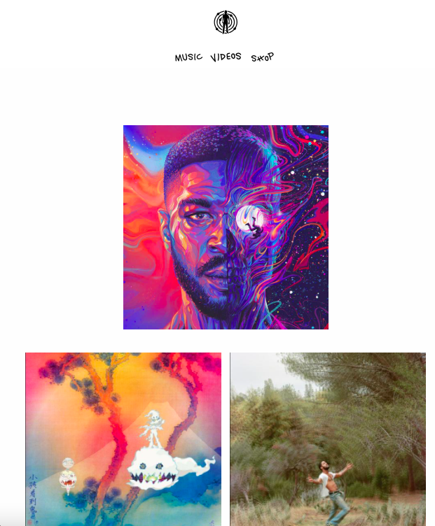
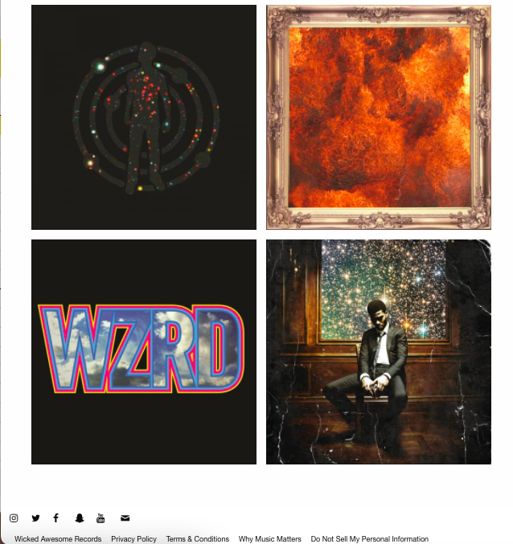

#### Screenshot(s) van de tweede pagina (small screen):
http://www.kidcudi.com/videos
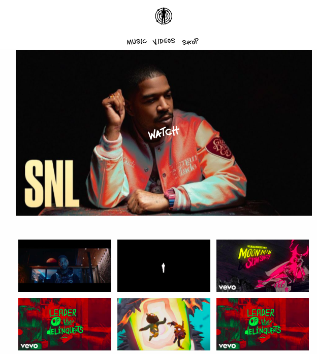
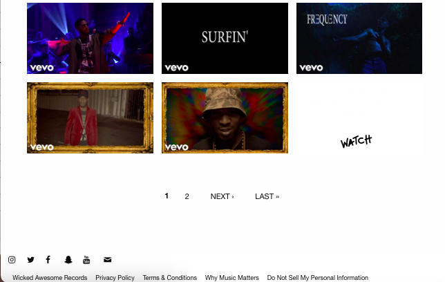
 

## Breakdownschets (week 1)

    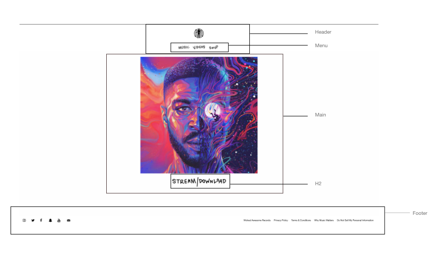

### de hele pagina: 

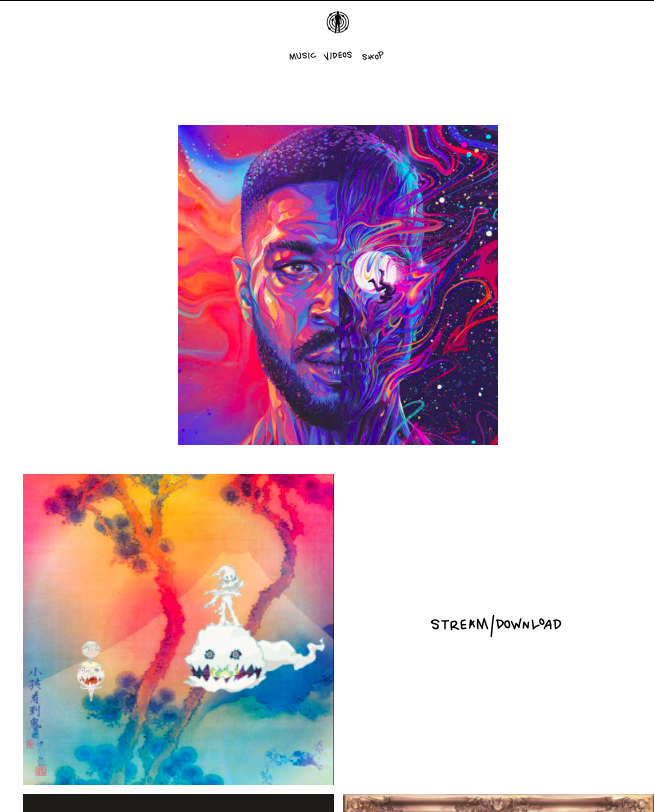
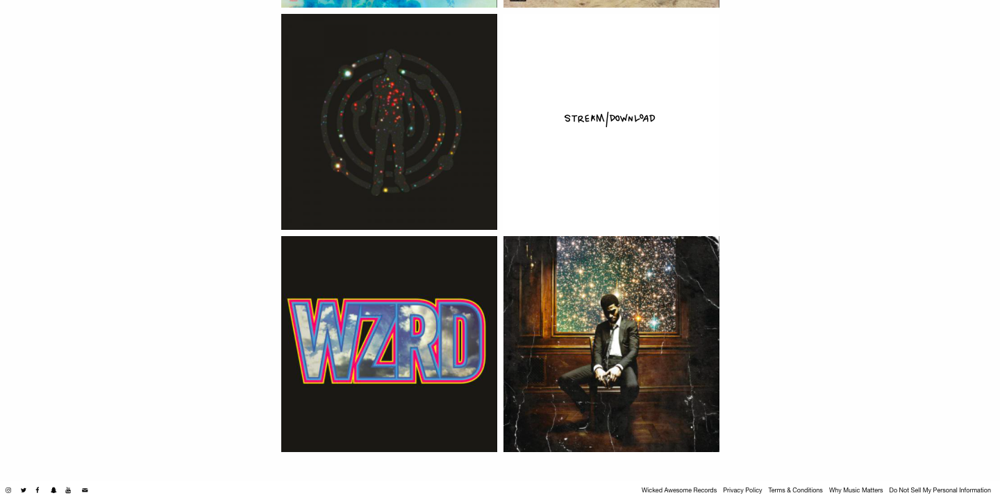

### dynamisch deel (bijv menu): 
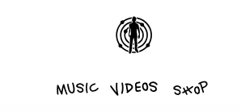

### wellicht nog een dynamisch deel (bijv filter): 
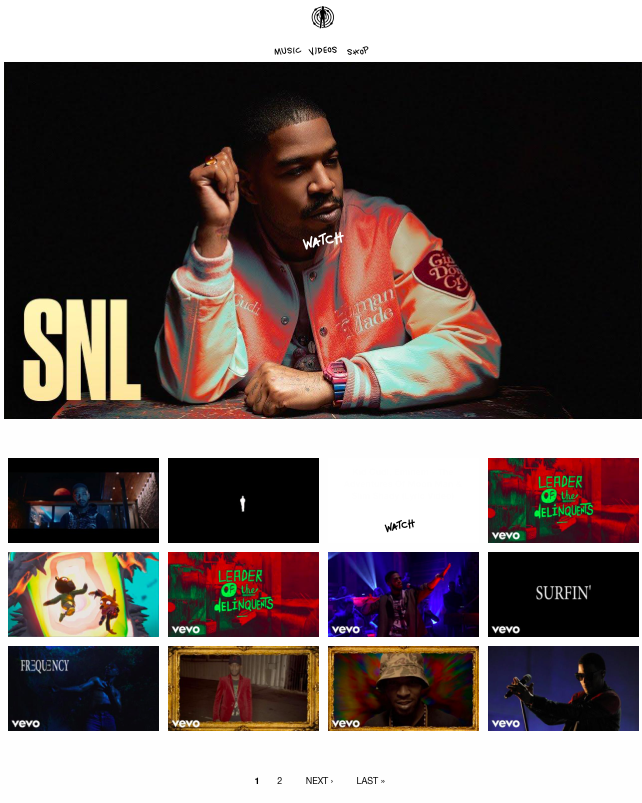

## Voortgang 1 (week 2)

uitwerken voor 1e voortgang

### Stand van zaken
Deze week probeerde ik de muziek pagina vorm te geven door de album covers in een flexbox te zetten. Dit ging nog niet helemaal goed omdat de afbeeldingen niet gecentreerd stonden. 

**Screenshot(s):**

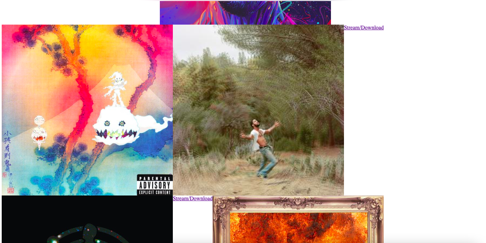

## Voortgang 2 (week 3)

uitwerken voor 2e voortgang

Ik heb er voor gekozen om de site wat anders te maken dan dat die normaal is omdat hij er anders best saai uit komt te zien.

Ik heb grids toegevoegd aan mijn website en meer content er ingezet. Ik had veel moeite om een animatie te bedenken en ben daar pas later mee begonnen dan ik eigenlijk wilde. Ik ben ook nu verder gegaan met de tweede pagina. 
Verder wil ik nog een slideshow maken in de header van de homepagina. 

### Stand van zaken

**Screenshot(s):**

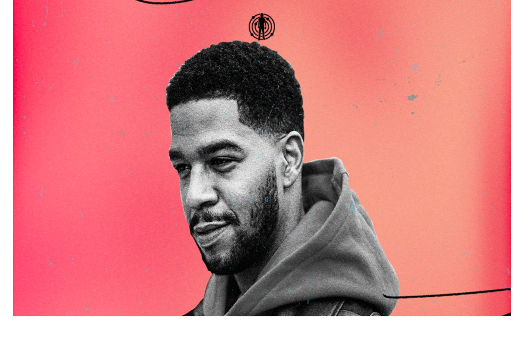
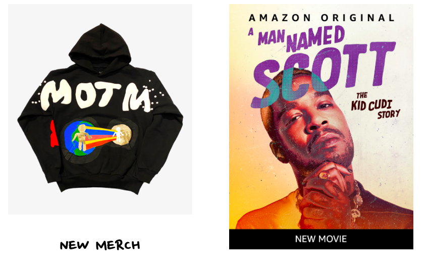
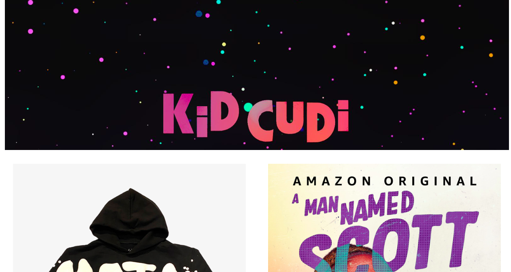

## Toegankelijkheidstest (week 4)

uitwerken na test in 8e voortgang

### Bevindingen
Lijst met je bevindingen die in de test naar voren kwamen:

#### Titel eerste bevinding
Videos zijn moeilijk aan te passen en spelen soms niet af doordat de link het niet doet of deze niet beschikbaar is.

Dit kan opgelost worden door de videos te downloaden. Dit heb ik via een youtube converter gedaan. Hierdoor kan ik zelf de videos makkelijk een class geven en de maten hiervan makkelijker aanpassen. 

#### Titel tweede bevinding. 

Ik wil meerdere afbeeldingen aan kunnen passen zonder dat ik ze 1 voor 1 hoef aan te passen. Dus wanneer ik het in de css bij 1 aanpas alle afbeeldingen gelijk aangepast zijn. 

Dit kan opgelost worden door de afbeeldingen in sections te zetten en deze allemaal dezelfde class te geven. 

## Voortgang 3 (week 4)

uitwerken voor 3e voortgang

### Stand van zaken
Ik heb moeite gehad gehad om aan frontend te werken. Ik vind animaties en de states best moeilijk om daarmee te beginnen. Ik ben bezig met de states en dat gaat tot nu toe prima. Voor de rest loop ik soms tegen wat dingetjes aan met positioneren.

Verder heb ik de buttons aangepast zodat wanneer je er nu overheen hovert de knoppen beter te zien zijn. En heb ik videos toegepast op een pagina die je kan bekijken. 

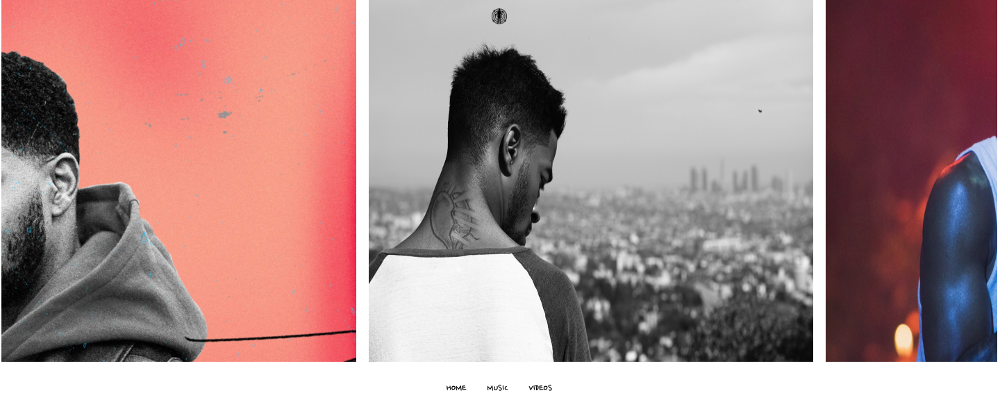
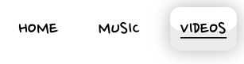
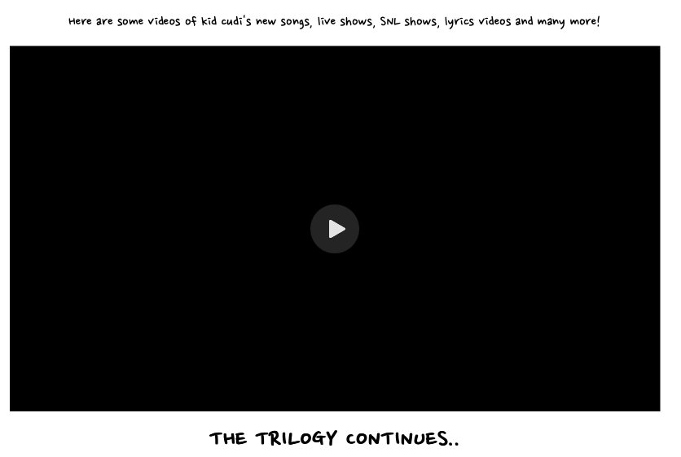

## Eindgesprek (week 5)

uitwerken voor eindgesprek

### Stand van zaken
Ik heb onder aan de pagina nu ook een pop up melding toegevoegd met de button 'sign up'. op deze pagina heb ik ook een hover op de afbeeldingen gezet van de albums. Verder heb ik ook een like button gemaakt waarbij er een hartje gaat bewegen als je hier op klikt. En verwijzen de afbeeldingen je door naar de spotify pagina van Kid cudi. 

### Screenshot(s)

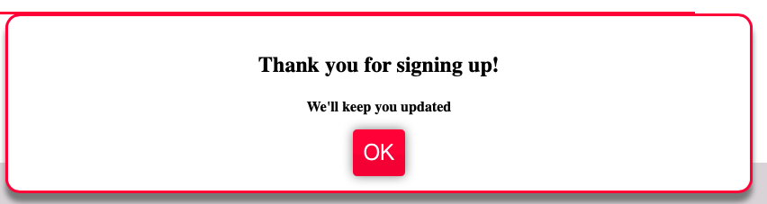
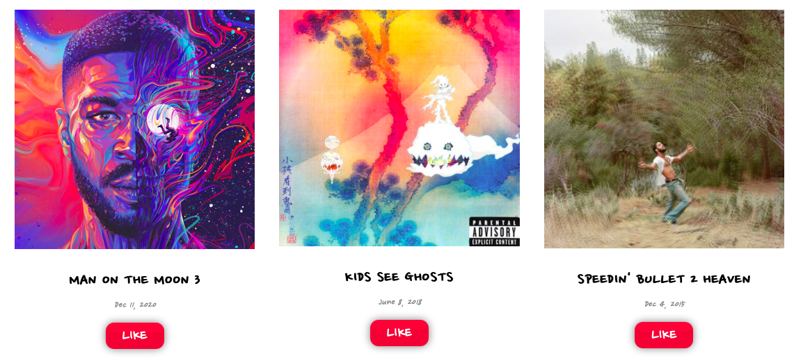

## Bronnenlijst

continu bijhouden terwijl je werkt

1. http://www.kidcudi.com
2. https://www.instagram.com/kidcudi/
3. https://open.spotify.com/artist/0fA0VVWsXO9YnASrzqfmYu
4. https://www.amazon.com/Man-Named-Scott-Kid-Cudi/dp/B09JWWCX2T
5. https://shop.kidcudi.com
6. https://www.esquire.com/entertainment/tv/a34196326/kid-cudi-we-are-who-we-are-hbo-interview-2020/
7. https://www.youtube.com/watch?v=zPcvAwp71uA // CSS Button Hover Animation Effects using Only HTML & CSS
8. https://www.youtube.com/watch?v=pGHOaY4dhAA // Pure CSS Responsive Image Slider

